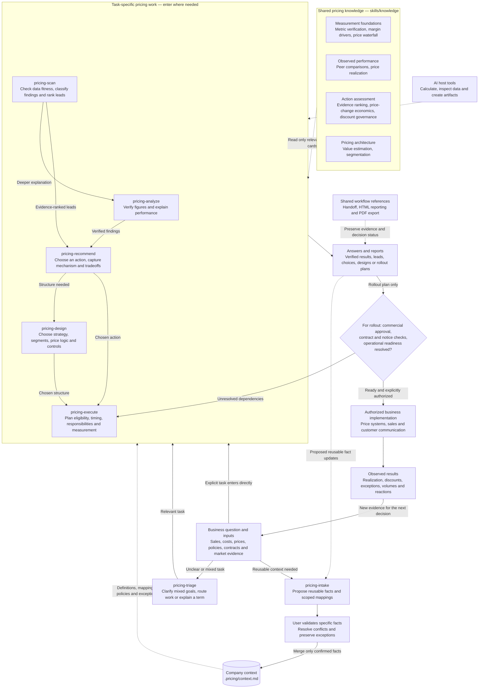

# How the pricing skills and knowledge base work together

The Pricing Plugin combines seven task-specific skills, a shared pricing knowledge base and validated company context to support a complete decision cycle: understand performance, find opportunities, choose actions, design pricing structures, plan rollout and measure results.

**Skills decide what work to do. Knowledge cards provide the methods. Company context defines what those methods mean for this business.** The AI host supplies calculation, file and reporting tools.

The diagram describes the current instruction-based plugin. Arrows represent information flow and useful handoffs; they are not automatic software calls or a mandatory sequence.

Solid arrows show task or evidence flow. Dotted arrows show shared support or proposed context updates. Implementation and observed results sit outside the plugin: `pricing-execute` produces a plan, while actual changes and communications require explicit authorization and suitable tools.

## What each skill contributes

| Skill | Responsibility | Result passed forward |
| --- | --- | --- |
| [pricing-triage](skills/pricing-triage/SKILL.md) | Clarify unclear goals, route the request or answer a brief definition | A focused task or definition |
| [pricing-intake](skills/pricing-intake/SKILL.md) | Validate and merge reusable business facts | Confirmed definitions, mappings, policies and scoped exceptions |
| [pricing-analyze](skills/pricing-analyze/SKILL.md) | Establish comparable measures, calculate results and reconcile supported drivers | Verified figures, explanations and remaining evidence gaps |
| [pricing-scan](skills/pricing-scan/SKILL.md) | Check data fitness, separate issues from commercial leads and rank evidence | A shortlist with observation/action confidence and next validation |
| [pricing-recommend](skills/pricing-recommend/SKILL.md) | Compare options and choose an action | A choice with capture mechanism, conditional economics, tradeoffs and risks |
| [pricing-design](skills/pricing-design/SKILL.md) | Create or redesign strategy and pricing structures | Price logic, segments, eligibility rules and controls |
| [pricing-execute](skills/pricing-execute/SKILL.md) | Plan rollout of a chosen action or structure | Dependencies, responsibilities, readiness decisions and a measurement plan |

Intake is useful onboarding, but it is not required before every task. A new pricing strategy can start in design; a margin question can start in analyze; a chosen increase can start in execute. Skills reuse applicable verified work and return to analysis only when missing evidence could change the decision.

## How the knowledge base supports the skills

The [knowledge index](skills/knowledge/index.md) selects cards by question. This shared library keeps methods consistent without loading every card for every request.

| Knowledge card | Method supplied | Main uses |
| --- | --- | --- |
| [Metric verification](skills/knowledge/metric-verification.md) | Confirm measure meanings; check numeric interpretation, matching, coverage, adjustments and comparability | Data-backed intake, analyze, scan and scenario calculations |
| [Margin drivers](skills/knowledge/margin-drivers.md) | Reconcile price, cost, mix, shared effects and residuals without inventing causes | Analyze |
| [Price waterfall](skills/knowledge/price-waterfall.md) | Trace supported adjustments across company-defined list, invoice, net and pocket levels | Price-level definitions and adjustment investigations |
| [Peer comparisons](skills/knowledge/methods/peer-comparisons.md) | Compare economically similar observations and qualify unexplained differences | Analyze and scan |
| [Price realization](skills/knowledge/methods/price-realization.md) | Measure historical realized-price movement using matched prior-period quantities | Analyze and rollout measurement in execute |
| [Discount governance](skills/knowledge/methods/discount-governance.md) | Apply complete policy conditions, approval authority and dated, scoped exceptions | Scan, design and execute; action eligibility where relevant |
| [Evidence ranking](skills/knowledge/methods/evidence-ranking.md) | Separate confidence in an observation from confidence in a justified, capturable action | Scan and recommend |
| [Price-change economics](skills/knowledge/methods/price-change-economics.md) | Size conditional revenue/contribution scenarios, cost changes and response sensitivities | Analyze, scan, recommend and requested rollout impacts |
| [Value estimation](skills/knowledge/methods/value-estimation.md) | Assess differentiated value against credible buyer alternatives | New strategy in design |
| [Segmentation](skills/knowledge/methods/segmentation.md) | Identify economically meaningful, enforceable pricing differences | New strategy and redesign in design |

## What makes the cycle coherent

**A common business basis.** `.pricing/context.md` retains only confirmed reusable facts. New exports still require actual data checks. A material unresolved measure or comparison choice holds the affected calculation while independently valid work continues. Findings, hypotheses and proposals remain in the answer/report until specific reusable facts are validated through intake.

**Evidence carried between tasks.** The [handoff reference](skills/references/handoff.md) preserves scope, definitions, sources, verified figures, confidence, unresolved inputs and whether a decision is proposed, chosen or approved. It normally lives inside the existing answer/report; a separate brief is saved only when requested.

**Outputs matched to the decision.** Small answers stay in chat. [HTML reporting](skills/references/html-reporting.md) supports substantial visual analysis, and [PDF export](skills/references/pdf-export.md) supports circulation reports when required. Reports reuse computed figures and retain material qualifications.

**A feedback loop grounded in observed results.** Rollout measurement supplies new evidence for analysis and scanning. Historical realization measures what happened; proposed-change economics describes conditional scenarios. Neither a scenario nor a recommendation establishes guaranteed benefit or approval to act.

Together these components support a comprehensive pricing decision system for B2B industrial products and spare parts. The current plugin has no separate calculation engine or data service; detailed account/product targets and negotiation scripts remain outside this version.
